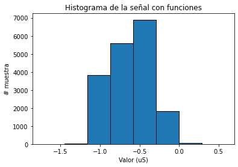

# Análisis y Contaminación de Señal Fisiológica

Este repositorio contiene un código para analizar y contaminar una señal fisiológica con diferentes tipos de ruido. El análisis incluye el cálculo de estadísticas descriptivas y la medición de la relación señal-ruido (SNR). La señal utilizada es "Subject10_AccTempEDA" de PhysioNet.

## Contenido

1. [Requisitos](#requisitos)
2. [Descripción del Código](#descripción-del-código)
3. [Estadísticos Descriptivos](#estadísticos-descriptivos)
4. [Histograma de la Señal](#histograma-de-la-señal)
5. [Contaminación de la Señal](#contaminación-de-la-señal)
    - [Ruido Gaussiano](#ruido-gaussiano)
    - [Ruido de Impulso](#ruido-de-impulso)
    - [Ruido Tipo Artefacto](#ruido-tipo-artefacto)

## Requisitos
- Librerías:
  - `wfdb`
  - `matplotlib`
  - `numpy`
  - `random`

## Descripción del Código
Este laboratorio tiene como objetivo caracterizar una señal descargada de la página de PhysioNet para calcular sus estadísticos descriptivos, como la media, la desviación estándar y el coeficiente de variación. En la segunda parte del laboratorio, se busca contaminar la señal con ruido, para lo cual se utilizarán diferentes tipos de ruido, como ruido gaussiano, de artefacto y de impulso, con el fin de determinar su relación señal-ruido (SNR).
### Importación de Librerías

```python
import wfdb
import matplotlib.pyplot as plt
import numpy as np
import random
```
## Obtención y Graficación de la Señal
```python
#Obtener los valores de Y de la señal
signal = wfdb.rdrecord('Subject10_AccTempEDA')
valores = signal.p_signal[:,1]
longitud =len(valores) #numero de muestras 
# Graficar la señal
plt.plot(valores)
plt.title("Señal Fisiológica")
plt.xlabel("# muestras")
plt.show()
```
<p align="center">
  
</p>
Obtenemos los valores de la señal fisiológica y los graficamos para visualizar la señal original.

## Estadísticos Descriptivos
### Cálculo Manual
```python
val_total= 0
for i in valores:
    val_total+=i
media_manual = (val_total/longitud)
 
diferencia_cuadrados = ((i-media_manual)**2 for i in valores)
suma_diferencia= 0 
for j in diferencia_cuadrados:
    suma_diferencia+=j    
desviacion_estandar_manual = (float(suma_diferencia/(longitud -1 )))**0.5
coeficiente_variacion_manual = (desviacion_estandar_manual / media_manual)
```
### Usando Funciones Predefinidas
```python

media_predefinida = np.mean(valores)
desviacion_estandar_predefinida = np.std(valores, ddof=1)
coeficiente_variacion_predefinida = (desviacion_estandar_predefinida / media_predefinida) 
```
Calculamos la media, la desviación estándar y coeficientes de variación tanto manualmente como utilizando funciones predefinidas para validar los resultados.
## Histograma de la Señal
### Usando Funciones Predefinidas
```python
plt.hist(valores, bins=10,edgecolor='black')
plt.title("Histograma de la señal con funciones")
plt.xlabel("Valor")
plt.ylabel("# muestra")
plt.show()
```
### Cálculo Manual
```python
num_bins = 10
min_val = valores[0]
max_val = valores[0]
for valor in valores:
    if valor < min_val:
        min_val = valor
    if valor > max_val:
        max_val = valor

bin_ancho = (max_val - min_val) / num_bins
bins = [0] * num_bins
for valor in valores:
    bin_cajita = int((valor - min_val) / bin_ancho)
    if bin_cajita == num_bins:  
        bin_cajita-= 1
    bins[bin_cajita] += 1

# Graficar el histograma manual
bin_borde = [min_val + i * bin_ancho for i in range(num_bins + 1)]
plt.bar(bin_borde[:-1], bins, width=bin_ancho, edgecolor='black')
plt.title("Histograma de la señal (manual)")
plt.xlabel("Valor")
plt.ylabel("# muestra")
plt.show()
```
<p align="center">
  
</p>
Creamos histogramas tanto utilizando funciones de Python como manualmente para visualizar la distribución de la señal.
## Contaminación de la Señal
### Ruido Gaussiano
```python
# Generar ruido gaussiano
ruido_gaussiano = np.random.normal(0, np.std(valores), len(valores))
signal_ruido_gaussiano = valores + ruido_gaussiano

potencia_senal = np.mean(valores ** 2)
potencia_ruido_gaussiano = np.mean(ruido_gaussiano ** 2)
print(potencia_ruido_gaussiano,potencia_senal)

# Calcular el SNR
snr_gaussiano = 10 * np.log10(potencia_senal / potencia_ruido_gaussiano)
print(f"SNR con ruido gaussiano: {snr_gaussiano:.2f} dB")

plt.plot(signal_ruido_gaussiano)
plt.title("Señal con Ruido Gaussiano")
plt.xlabel("# muestras")
plt.ylabel("Amplitud")
plt.show()
```
### Ruido de Impulso
```python
# Generar ruido de impulso
ruido_impulso = np.zeros(len(valores))
num_impulsos = int(0.01 * len(valores))  
impulso_amplitud = np.max(np.abs(valores)) * 2  

for _ in range(num_impulsos):
    posicion = random.randint(0, len(valores) - 1)
    ruido_impulso[posicion] = impulso_amplitud * (1 if random.random() < 0.5 else -1)

signal_ruido_impulso = valores + ruido_impulso
potencia_ruido_impulso = np.mean(ruido_impulso ** 2)

snr_impulso = 10 * np.log10(potencia_senal / potencia_ruido_impulso)
print(f"SNR con ruido de impulso: {snr_impulso:.2f} dB")

plt.plot(signal_ruido_impulso)
plt.title("Señal con Ruido de Impulso")
plt.xlabel("# muestras")
plt.ylabel("Amplitud")
plt.show()
```
### Ruido Tipo Artefacto
```python
# Generar ruido tipo artefacto
ruido_artefacto = np.zeros(len(valores))
num_artefactos = int(0.01 * len(valores))  
artefacto_amplitud = np.max(np.abs(valores)) * 2 
artefacto_duracion = 10  

for _ in range(num_artefactos):
    posicion_inicio = random.randint(0, len(valores) - artefacto_duracion)
    ruido_artefacto[posicion_inicio:posicion_inicio + artefacto_duracion] = artefacto_amplitud

signal_ruido_artefacto = valores + ruido_artefacto
potencia_ruido_artefacto = np.mean(ruido_artefacto ** 2)

snr_artefacto = 10 * np.log10(potencia_senal / potencia_ruido_artefacto)
print(f"SNR con ruido tipo artefacto: {snr_artefacto:.2f} dB")

plt.plot(signal_ruido_artefacto)
plt.title("Señal con Ruido Tipo Artefacto")
plt.xlabel("# muestras")
plt.ylabel("Amplitud")
plt.show()
```
En esta sección, contaminamos la señal original con diferentes tipos de ruido (gaussiano, de impulso y tipo artefacto) y calculamos el SNR para cada tipo de ruido. 
Luego, graficamos la señal contaminada para visualizar el impacto del ruido. Este proyecto demuestra cómo analizar y procesar una señal fisiológica, 
calculando estadísticas descriptivas, creando histogramas, y evaluando el impacto del ruido en la señal a través de la relación señal-ruido (SNR). 

